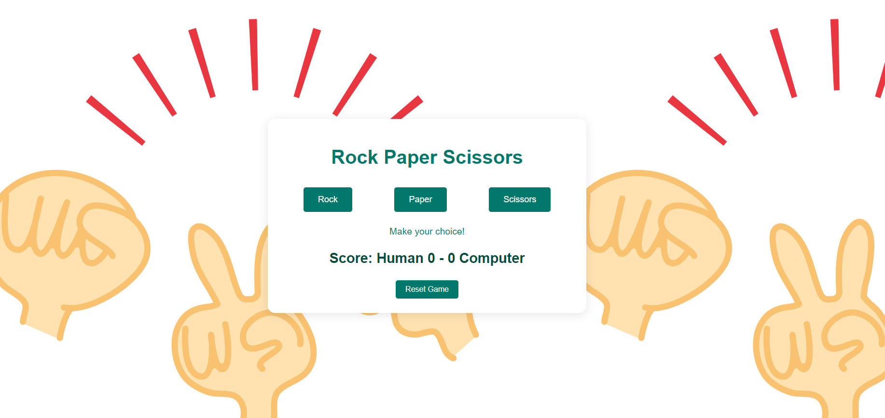

# Rock Paper Scissors Game

A simple Rock Paper Scissors game built with HTML, CSS, and JavaScript. The game allows a human player to play against the computer, keeps track of the score, and has a reset button to start the game over.

## Features

- Play Rock, Paper, Scissors against the computer.
- Keeps track of the score between the human player and the computer.
- Displays the result of each round.
- Reset button to reset the score and start the game over.

## Live Demo

Check out the live demo [here](#).

## Screenshots

## Getting Started

These instructions will get you a copy of the project up and running on your local machine for development and testing purposes.

### Prerequisites

You will need a web browser to run this game. Any modern browser will work.

### Installation

1. Clone the repository:
git clone https://github.com/sapandeep31/rock-paper-scissors
Navigate to the project directory:
cd rock-paper-scissors
Open the index.html file in your web browser:
open index.html
Usage
Click on one of the buttons (Rock, Paper, or Scissors) to make your choice.
The result of the round will be displayed, along with the updated score.
Click the "Reset Game" button to reset the scores and start a new game.
Built With
HTML
CSS
JavaScript
Contributing
Feel free to fork this repository and submit pull requests. If you find any issues, please open an issue on the repository.

License
This project is licensed under the MIT License - see the LICENSE file for details.

Acknowledgments
Background image from iStock.
